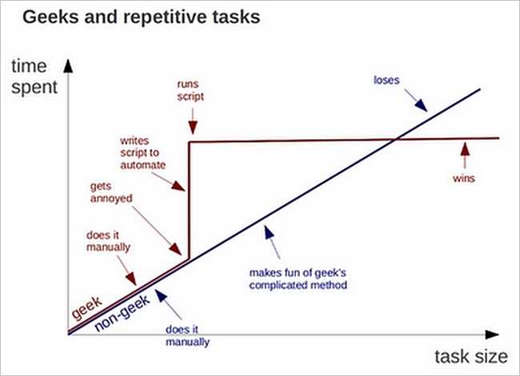

Modified from content [HERE](https://github.com/datacarpentry/2015-05-30-HASTAC/blob/gh-pages/shell-intro/README.md), [HERE](https://github.com/datacarpentry/2015-05-30-HASTAC/blob/gh-pages/shell-libcatalogue/report-data.md), and [HERE](https://github.com/ComputeCanada/2017-05-15-ualberta/blob/gh-pages/__CommandLineResources/CommandLineWalkThrough.md) with thanks to the earlier contributors Cam Macdonell, Tracy Teal, Greg Wilson, Dennis Tennen, Paul Wilson, Milad Fatenejad, Sasha Wood, and Radhika Khetani.

# \*nix Walkthrough

<!-- Note that zero width spaces (U+200B) are used in this document when formatting stops in the middle of a word. -->

This is a script of sorts for running the Bash shell portion of a Data Carpentry Workshop with Digital Humanities researchers.  It is based on content from the Software Carpentry shell-novice lessons.

Three things to make clear before heading into this workshop:

1. Silence is golden (or frustrating)
2. Capitalization matters
3. Spaces matter

Yes, these will be brought up throughout the workshop as they arise but there are enough pitfalls for participants without having these snags waiting for them too.

## Shell Overview

The *shell* is a program that presents a command line interface which allows you to control your computer using commands entered with a keyboard instead of controlling graphical user interfaces (GUIs) with a mouse/keyboard combination.  The terms "shell" and "command line" are often used interchangeably.  When most people talk about working in a shell or on a command line the operating system that they are using is usually a flavour of GNU-Linux and will often be assumed to be the case.[^GNU-Linux]

[^GNU-Linux]: We use the term "GNU-Linux" her rather than the more common "Linux" to pay respect to its full history rather than just one event.  When Richard Stallman started the GNU (GNU's Not Unix) project he was able to assemble a wide range of important and useable tools, he just wasn't able to get a kernel, roughly the program that handles all the inputs and outputs from the hardware associated with a computer.  That kernel was eventually provided by Linus Torvalds.  Both the tools and the kernel are essential to the project and the name "GNU-Linux" appropriately acknowledges this.

There is more than one shell and each shell can come in different versions.  The shell that we will be using today is the most common.  It is known as BASH, which stands for "Bourne Again SHell".[^BASH]

[^BASH]: The shell's name is an acronym for Bourne-again shell, punning on the name of the Bourne shell that it replaces[11] and on the term "born again" that denotes spiritual rebirth in contemporary American Christianity [Wikipedia](https://en.wikipedia.org/wiki/Bash_(Unix_shell)). This is programmer humour.

There are many reasons to learn about the shell.

* For some tools, such as Mallet (a popular topic modeller) you have to use the shell. There is no graphical interface. If you want to collaborate with people from the sciences this will become even more common.
* Most shells were written in the C language to process text context.  They are very fast and can give you the power to do your work more efficiently and
more quickly.  When you need to do things tens to thousands of times,
knowing how to use the shell is transformative.
* Using the shell gives you the ability to have repeatable data processing.
* To use remote computers or cloud computing, you need to use the shell.
* We're going to use it in this class, for all of the reasons above.
* If you are going to work with GNU-Linux, the standard OS for scientific and high-performance computing, then you'll end up here sooner or later.

In this portion of the workshop we're going to:

* learn how to use BASH by using BASH
* learn about why shells are the way they are
* automate a repetitive process

## Information on the shell

Shell cheat sheets: 
* [http://fosswire.com/post/2007/08/unixlinux-command-cheat-sheet/](http://fosswire.com/post/2007/08/unixlinux-command-cheat-sheet/)
* [https://github.com/swcarpentry/boot-camps/blob/master/shell/shell_cheatsheet.md](https://github.com/swcarpentry/boot-camps/blob/master/shell/shell_cheatsheet.md)

Explain shell - a web site where you can see what the different components of
a shell command are doing.
* [http://explainshell.com](http://explainshell.com)
* [http://www.commandlinefu.com](http://www.commandlinefu.com)

## How to access the shell

The shell is already available on Mac and Linux. Windows10, now has some built-in commands within the command prompt to mimic the behaviour of the shell and you have the option of installing what amounts to a version of Ubuntu to get an ever fuller experience.  If you have an earlier version of Windows then you'll need to install a special program to follow along in the workshop that this document accompanies.

###Mac
---
Mac OSX is built on top of a version of BSD (Berkeley Software Distribution), a series of Unix variants. As a consequence it has a shell built in that will do everything we need it to today.  To access the shell either:

* From the Finder go through the following folders: Applications -> Utilities -> Terminal.  
* Hold down the Command Key and press the Spacebar.  In the Spotlight search window that appears start typing "Terminal".

Regardless of the method used you might find it useful to drag the Terminal application icon to your Dock for easy access in the future.

While OSX has a terminal the full power is not available by default.  If you would like to unlock this then you can do the following:

1. Open a terminal window.
2. Type `xcode-select --install` and then press Enter.
3. From the pop-up window choose "Install"
4. Wait for the Command Line Tools package download to complete, it’ll be about 130MB and installs fairly quickly depending on your connection speed.
5. You're done.  If you'd like to check this then you can type `svn` into the terminal and you should see "Type 'svn help' for usage." as a response rather than a "command not found" error.

###Windows
---

Windows is its own operating system with its own development history and as a result it has something that _looks_ like BASH but that isn't, the Command Prompt.  If you are using a current version of Windows10 then you already have a set of shell commands that have been added to the Command Prompt and so you can open the Command Prompt and skip the rest of this section.

If you have an earlier version of Windows then you'll need to install a program that emulates BASH on Windows.  There are more than a few options for this and we often recommend the [home, portable edition of MobaXterm](http://download.mobatek.net/10220170312132617/MobaXterm_Portable_v10.2.zip) (The portable edition installs everything in one folder, making it easy to find and easy to remove if you decide you don't like it.  We recommend installing it on your desktop so it is easy to find).  _HOWEVER_, for this workshop [_Git for Windows_](https://git-for-windows.github.io/) is the better option because it saves some extra hoop jumping around installing Git _and_ we don't need any of the fancy features that tools like MobaXterm provide.

To install Git for Windows go to the [Git for Windows homepage](https://git-for-windows.github.io/) and choose the download option.  Follow the install procedure, choosing the default options each time.

###GNU-Linux
---
GNU-Linux, even versions with Graphical User Interfaces (GUIs), is built on/around a shell environment so you will have one installed by default.  There are many variants of GNU-Linux so describing how to get to the shell is unlikely to be of much help.  Fortunately, most GNU-Linux users usually come to the workshop knowing how to access the shell on their system.  If this is not the case then just let someone who is part of the workshop know and they'll help you out.

Note that it is possible that your shell isn't BASH.  In somecases this won't matter and you can likely follow along since most of the commands we will look at today will be interchangeable across shells.  If this proves challenging then you can likely switch to BASH by typing `$ bash` at the command prompt (we'll explain this next). If you are unsure what shell you have you can type `$ echo $0` and you should see `-bash` as the result if you are using BASH.

## Commands & Navigation

### Read, Execute, Print, Loop (REPL)

Open a BASH terminal window and you'll see:
	
	"some information about the user/system" $ 

[On Windows if you're in the Command Prompt then you'll see something that looks like `C: path to current directory >`.  For the next few steps just suppose that the `>` is the same as the `$` until we login to the remote system.  You won't be able to do *exactly* everything but it will be close enough to get you started.]

We'll ignore the "some information about the user/system" and just abbreviate this to "$" in the command examples shared here.  Don't type the "$" it's there just to tell you to type what is after it.  If you see content in the text block that doesn't have a prompt then it is either wraping over from the line above or output, context should usually make this clear.

If you want to give yourself some extra space by removing the "some information about the user/system" for the duration of this BASH session then type the command: `PS1='$ '` into your shell, your window should look like all the examples in this workshop.  This isn’t necessary to follow along (in fact, your prompt may have helpful information you want to know about). This is up to you!

Let's get started. Type:

	$ whoami

Then press the enter key.  The response will be `someusername` (Hopefully yours!).  

What is happening here when we type `whoami`?  A process along the lines of the following takes place:

1. the computer looks for a program called `whoami` in what is known as the PATH, a set of directories it expects to find programs in.
2. it runs that program 
3. it displays that program’s output, then
4. it displays a new prompt to tell us that it’s ready for more commands.

Let's find out where we are:

	$ whereami

While it might seem like this would tell you where you are (within the directory structure of the system, not in the galaxy) it will fail with something like `whereami: command not found` (UNIX) or `INFO: Could not find files for the given pattern(s).` (GitBash) or `'whereami' is not recognized as an internal or external command, operable program or batch file` (Windows).

So, the command we actually need, at least on GNU-Linux and MacOS is:

	$ pwd

This stands for "Print Working Directory" and if you're on a GNU-Linux machine or MacOS you'll get something that looks like */Users/someusername*.  But why doesn't `$ whereami` work?  Well, quite simply there isn't a command named `whereami` on the PATH for any of the systems.  If you want to know why the command is called `pwd` rather than `whereami` given that we have a `whoami` command then the answer is that the name of the program is a historical artifact brought about by having so many developers contribute to the development of GNU-Linux.  There are a lot of commands that will feel this way, that they ought to have been called something else or to have a different syntax.  This makes using the shell feel a bit like being asked to write in a secret code where you don't know the code!  Fortunately it is easy to ask a search engine for help these days.  In the past you'd be stuck with books, asking for help, and a lot of trial and error.

If you are using Windows then `pwd` won't work.  Instead you'll need:

	> cd

>**Comprehension Check:** When you type a command at the prompt and press ENTER the first thing the computer does is:

> 1. search the entire computer for the command you typed
> 2. search the current directory for the command you typed
> 3. search a special set of directories for the command you typed

> **Answer:** 3

It is at this point in the workshop that we'll need to move to a standard shell environment to prevent the differences between the shells provided by the different operating systems from complicating this introduction.  To achieve this standard environment everyone in the workshop will login to the same remote.

### Remote Login

To login to the remote system we'll need a new command, `ssh`.  `ssh` is the "Secure SHell" command and it allows an encrypted connection to be opened with a computer system somewhere else as long as the appropriate credentials are held.  What this amounts to is the ability to execute commands on the remote system through the terminal interface on your local system.  As a command `ssh` is a little more complicated than `whoami` and `pwd` because it requires additional information to be provided, namely the relevant login information for the remote system.  It might look like the following:

	$ ssh username@remotesystemname.com
	
Spaces are an important piece of punctuation in the Shell and are often used to separate commands from the arguments that will be passed to those commands.  This is the case here.  The argument used here, `username@remotesystemname.com`, has a particular form and it is no conincidence that it looks like an email address.  For us to login to a remote system we need the name of that remote system *and* the name of the user of that system that we would like to login as.

If you enter the appropriate information then the first thing that you will be presented with in response is a question about the authenticity of the remote server.  It will look something like:

	The authenticity of host 'ccf-hss.c3.ca (206.167.180.170)' can't be established.
	RSA key fingerprint is SHA256:0aRLrgVAHtCoApHJGKltD6tb2N36tN17vJVAkDkSJ/4.
	Are you sure you want to continue connecting (yes/no/[fingerprint])?

This is there to make sure that you are connecting to the site that you want to connect to.  It is the equivalent of delivering a package to an address (everything after the @ in the ssh command) *and* checking the ID of the person who answers the door (the RSA key fingerprint).  For most instances it is fine to press `y` and accept.  If you have been using a system for a while though and suddenly you are presented with something like this then you might want to confirm that it is the right system, just as if you had been delivering packages to an address for a while and suddenly someone new started answering the door.

Next you'll be asked for a password.  If this is your first time logging in to a remote system with `ssh` then the behaviour of the password prompt can be disconcerting.  When you type at the password prompt you won't see anything, not even a `*` or a `#` to show how many characters you have typed.  This is a security feature to make sure that that anyone looking over your shoulder doesn't have an easier time guessing youp password because they know how many characters it has.  Type carefully.

Once you are authenticated your prompt will change, indicating you are now executing commands on the remote system.  For the purposes of this walkthrough we'll assume that every command from here on is executed on the remote system until the very end where we use the secure copy command to move everything you do during the workshop onto your local computer.

>**Comprehension Check:** What questions do you have about logging in to the remote system?

### Looking & Moving Around

Let's look around inside the current directory.

	$ ls

We'll see a list of files inside this directory.  Let's call this the "***l***​ist directory ***s***​tructure" command.  

We can also look around from where we are.  Assuming that the workshop that this workshop is accompanying is being run by someone in the Compute Canada Federation it is really likely that when you ran `ls` that you were told that there are two things in your current folder, something called "projects" in blue and something called "scratch" in white.  These are there because the remote system you are logging into is made to mimic the setup of the actual systems used across the Compute Canada Federation.  "projects" is a folder inside the current directory that every account has.  It is the place where people put work they want to keep.  "scratch" is a link to a folder that all users of a system share and is intended to be a sort of communal whiteboard.  "projects" is permanent (as long as you maintain your account) but is generally rather small.  "scratch" is very, very large but the files inside it are deleted every few months.

Rather than simply look at the folders we can look into them as well:

	$ ls projects

What you see when you run this command will be the contents of the projects folder that is inside your home folder.  Not sure where your home folder is?  Run `pwd` to check.

Rather than just look at the Desktop folder let us make it the active directory:

	$ cd projects

`cd` is the _change directory_ command and it allows us to change what our active directory is within the shell.  To see what this means run the `ls` command again and note how the result is now the same as when `ls projects` was run when your home directory was the active one.

Now that we are in the projcets directory though, how do we get back?

There are three approaches to doing this and we'll look at each.

**Absolute method.** The *print working directory* command will tell you what your current directory is.  You can use this information as input into the cd command to move back to the original directory.  This is the absolute method because you are explicitly stating the full, absolute location of the directory that you would like to move into.

	$ pwd
	/home/user001/projects
	$ cd /home/user001
	$ pwd 
	/home/user001
	
**Relative method.**  In the shell a single dot (`.`) with regards to files and directories means *this directory*.  This is important from time to time because you might want to pass a fancy command to say "from the directory I am currently in do the following...".  More important for our current situation is to know the way to declare the *parent of this directory*.  This is done with a double dot (`..`).  Both work as follows.

	$ pwd
	/home/user001/projects
	$ cd .
	$ pwd 
	/home/user001/projects
	$ cd ..
	$ pwd
	/home/user001	

**Shortcut method.**  There are a few places you can quickly jump to directly from any place on the system.  One of them is your home directory (typically the directory that you start in when you start a new shell session).  For us this is the parent of the the projects folder and so we can use the shortcut.  What is the shortcut?  If you look back through the commands that you have run on the remote system you'll note that the prompt when you first logged in looked like `[user001@login1 ~]$`.  The `user001` is who you are logged in as (adjust this for your login name).  The `login1` is the name of the part of the system we are on (large computer systems like the one we are logged into are made up of many parts; these "clusters" typically have a part of the system that handles intial user login and any light workloads; we are currently in this part of the remote system, typically called a "login node".) But what about the `~`? he "~" is the "tilde" character and it is usually found with the "backtick" character under the ESC key.  It can be accessed by holding SHIFT and pressing "\`".  The `~` is the abbreviation for going home and can be used with `cd`.

	$ pwd
	/home/user001/projects
	$ cd ~
	$ pwd 
	/home/user001

Actually, there is even a shortcut for the shortcut!  `cd` is the equivalent of `cd ~`.

	$ pwd
	/home/user001/projects
	$ cd 
	$ pwd 
	/home/user001

The other shortcut to note is the `/`.  This is the shortcut to the "root directory".  On a GNU-Linux system all the directories are stored inside one "top level" directory called the "root directory".  `cd /` will take you to that directory.

>**Comprehension Check:** Go to the root directory and use one of the methods covered about to get back to the home directory.  Go to the root directory a second time and use a different method to get back to the home directory.

> **Comprehension Test:**
For a hypothetical filesystem location of **/home/amanda/data/**, select each of the below commands that Amanda could use to navigate to her home directory, which is **/home/amanda**

> 1. cd .
> 2. cd /
> 3. cd /home/amanda
> 4. cd ../..
> 5. cd ~
> 6. cd home
> 7. cd ~/data/..
> 8. cd
> 9. cd ..

> **Answer:** 3, 5, 8, 9

>**QUESTION:** If someone is in /Users/nelle/ then how do they get to /Users/larry/ using cd and a relative address?
>
>**ANSWER:** `cd ../larry`

> If **scrolling through the history** with the arrow keys has not come up yet then this is a good time to prompt it.

### More Looking Around and Looking for Help

<!--Now we'll get the data that we need for the rest of this the workshop by issuing the following command:

	$ git clone https://github.com/ComputeCanada/DC-shell_automation  

Git is a tool designed for managing software development by providing version control.  One of the nice bonuses tha comes along with using it is that you are able to make copies of other people's work as long as they have been shared within an online space for this purpose (these spaces are usually known as "repositories").  Git is workshop in and of itself so all we're going to do today is use its ability to copy files.

If successful the `git clone` command will have made new directory on your desktop called "DC-shell_automation".  Let's move into it:-->

<!--
Method for shortening the URL *AND* keeping the .tar.gz or .zip parts of it is from https://gist.github.com/dikiaap/01f5e2ba3c738012aef0a8f524a6e207

curl https://git.io/ -i -F "url=https://github.com/YOUR_GITHUB_URL" -F "code=YOUR_CUSTOM_NAME"

curl https://git.io/ -i -F "url=https://github.com/ComputeCanada/DC-shell_automation/raw/master/CCF-HSS-SHELL.zip" -F "code=CCF_HSS_SHELL.zip"

-->

For the rest of this workshop to work we need to grab some data from the web.  There are many tools and methods to do this.  We'll use a tool called `wget`.  Think of it as the "Web Get" command.

	$ wget https://git.io/CCF_HSS_SHELL.zip
	
	--2021-02-18 05:45:50--  https://git.io/CCF_HSS_SHELL.zip
	Resolving git.io (git.io)... 3.213.223.141, 3.229.59.32, 52.203.100.2, ...
	Connecting to git.io (git.io)|3.213.223.141|:443... connected.
	HTTP request sent, awaiting response... 302 Found
	Location: https://github.com/ComputeCanada/DC-shell_automation/raw/master/CCF-HSS-SHELL.zip [following]
	--2021-02-18 05:45:50--  https://github.com/ComputeCanada/DC-shell_automation/raw/master/CCF-HSS-SHELL.zip
	Resolving github.com (github.com)... 140.82.113.3
	Connecting to github.com (github.com)|140.82.113.3|:443... connected.
	HTTP request sent, awaiting response... 302 Found
	Location: https://raw.githubusercontent.com/ComputeCanada/DC-shell_automation/master/CCF-HSS-SHELL.zip [following]
	--2021-02-18 05:45:50--  https://raw.githubusercontent.com/ComputeCanada/DC-shell_automation/master/CCF-HSS-SHELL.zip
	Resolving raw.githubusercontent.com (raw.githubusercontent.com)... 185.199.111.133, 185.199.108.133, 185.199.110.133, ...
	Connecting to raw.githubusercontent.com (raw.githubusercontent.com)|185.199.111.133|:443... connected.
	HTTP request sent, awaiting response... 200 OK
	Length: 1119213 (1.1M) [application/zip]
	Saving to: ‘CCF_HSS_SHELL.zip’
	
	CCF_HSS_SHELL.zip                             100%[==============================================================================================>]   1.07M  --.-KB/s    in 0.04s   
	
	2021-02-18 05:45:50 (28.4 MB/s) - ‘CCF_HSS_SHELL.zip’ saved [1119213/1119213]

There is a lot of output here.  Most of it is connection information.  What we care about is that the last few lines seem to indicate that the file was successfully downloaded.

>**Comprehension Check:** How do we check that the file really was downloaded?

> 	$ ls

Added to our current directory is PDF file and a directory called LibraryData.  The PDF is a write-up of the walkthrough that we are following for this workshop.  Don't worry, you'll get this on your local computer at the end of the workshop.  The directory holds the data that we'll be using for the rest of the workshop.  Let's go into it and have a look.

	$cd LibraryData
	
> If **tab completion** has not come up by now then this is the time to introduce it.

Once you are inside this directory have a look around:

	$ ls

Once you've seen what's here try the following variants of the `ls` command to see what happens:

	$ ls -a

	$ ls -l
	
	$ ls -F

These new options are called "flags" and adding them to the command turns on (or sometimes off) various features.  `-a` is the "show all" flag and it will show all files in the directory.  `-l` is the "long format" flag and it will give more information about each file.  `-F` is the "disambiguate folders" flag and will put a `/` after folders and a `*` after exectuables.

There are often a lot of flags available for each command.  To see what they are for each command you have two options:

1. Search on the Internet.  

2. Use the "man" pages if they are available.  Back in the day though you were in luck if you had a book or a knowledgeable friend.  Without those you'd need to resort to the manual pages that were included with every program that was part of the shell.  These can be accessed with the `man` command.  

		$ man ls

When inside the manual program `h` will get you a help screen that you can use the arrow keys to scroll around and `q` will quit, putting you back at the prompt.

>**Comprehension Check:** What will `$ ls -al` do?

>**Answer:** List all the files in a long format.

>Look at the output and point out the files **./** and **../**.  Point out that the single dot is a self reference to this directory and that the double dot is a reference to the directory above this one.
 

>**Comprehension Check:** What does `$ ls ..` do?

>**Answer:** Show the contents of the directory above the current one.

>**Comprehension Check:** What flag or flags should be used with `ls` to print the file size in a human readable format?

>**Answer:** `ls -lh`

At this point they are ready to recognize the basic command structure:

	**command** *space* **flags** *space* **list of files separated by spaces**

## Working with Data

Consider the following data as an example of a spreadsheet that a librarian may find themself working with.

Our task is to figure out the top ten titles at any given library branch in Edmonton using the information we are given.  We could do this with a spreadsheet program but only if we had to do it only a few times.  After a point being able to write a script to automate a process becomes really valuable.

We could also use a programming language like Python to do this but this is a workshop on learning the Shell so that wouldn't help very much.  Besides, there are things that can be done in a Shell much faster than the alternatives once the commands are known.  The point here is not an expectation that you'll be a Shell scripting expert after this, nor that you'll remember all the commands, but only that you'll have a good sense about what is possible.

### Viewing files

We'll start by moving into the LibraryData folder and having a look at the content of the files.

	$ cd LibraryData
	$ ls
	EPLABB.csv		EPLIDY.csv		EPLMLW.csv
	EPLCAL.csv		EPLJPL.csv		EPLMNA.csv
	EPLCLV.csv		EPLLCP.csv		EPLRIV.csv
	EPLCPL.csv		EPLLHL.csv		EPLSPW.csv
	EPLCSD.csv		EPLLON.csv		EPLSTR.csv
	EPLGMU.csv		EPLMCN.csv		EPLWHP.csv
	EPLHIG.csv		EPLMEA.csv		EPLWMC.csv

Each of these files is a listing of the top ten books with the highest number of holds at Edmonton Public Library, each week from 9 AM Monday to 9 AM Monday, organized by customer home library branch.  These are comma separated value files.

We can look into them individually by using the concatenate command on the first CSV file:

	$ cat EPLABB.csv
	Row ID,Branch ID,Branch Name,Number of Holds,Title,Author,As of Date,Web URL
	EPLABB20150316Fifty shades of Grey / E.L. James,EPLABB,Abbottsfield - Penny McKee Branch,5,Fifty shades of Grey / E.L. James,James E L,03/16/2015 12:00:00 AM,http://epl.bibliocommons.com/search?t=smart&q=fifty%20shades%20of
	EPLABB20150316The back of the turtle : a novel / Thomas King,EPLABB,Abbottsfield - Penny McKee Branch,6,The back of the turtle : a novel / Thomas King,King Thomas,03/16/2015 12:00:00 AM,http://epl.bibliocommons.com/search?t=smart&q=the%20back%20of
	...

`cat` is the command to concatenate files.  Concatenation is a join operator.  The command also prints out the consequences of the concatenation to the screen.  If you only give it one file then it just spits back that one file.  This is a great example of tools being very useful but not quite in the way that their name or historical purpose might suggest.

>**Question:** What will the *-n* flag do when run with **cat**?

>**Answer:** Prints the line numbers for each line in each file.

Chances are that this will overflow your screen, making it a real challenge to see what's inside.  Instead of `cat` we can use a special command just for looking at the top of files:

	$ head -n EPLABB.csv
	Branch ID,Branch Name,Number of Holds,Title,Author,As of Date,Web URL
	EPLABB,Abbottsfield - Penny McKee Branch,5,Fifty shades of Grey / E.L. James,James E L,03/16/2015 12:00:00 AM,http://epl.bibliocommons.com/search?t=smart&q=fifty%20shades%20of
	...

`head` allows us to just look at the head of a file.  The optional `-n` flag followed by a number tells it how many lines to return.  Setting the flag value to 2 will give us both the header *and* the first line, allowing us to see what we are working with without being overwhelmed.

	$ head -n 2 EPLABB.csv 
	Branch ID,Branch Name,Number of Holds,Title,Author,As of Date,Web URL
	EPLABB,Abbottsfield - Penny McKee Branch,5,Fifty shades of Grey / E.L. James,James E L,03/16/2015 12:00:00 AM,http://epl.bibliocommons.com/search?t=smart&q=fifty%20shades%20of
	EPLABB,Abbottsfield - Penny McKee Branch,6,The back of the turtle : a novel / Thomas King,King Thomas,03/16/2015 12:00:00 AM,http://epl.bibliocommons.com/search?t=smart&q=the%20back%20of
	EPLABB,Abbottsfield - Penny McKee Branch,6,Minecraft annual / [edited by Jane Riordan ; written by Jane Riordan with 3 others],Riordan Jane,03/16/2015 12:00:00 AM,http://epl.bibliocommons.com/search?t=smart&q=minecraft%20annual%20/

If you want to peak at the bottom of the file then you can do that with `tail`:

	$ tail -n 3 EPLABB.csv

Our process from here is going to roughly be the following:

* get rid of the header
* extract the title from each line
* count the number of times each title appears
* sort the resulting list

While we are about to go through the details on how to do this note that typically the details matter much less than being able to imagine how a file might be processed in the first place.  The details are just syntax.  If you know the process but not the syntax you can always ask.

This said, here goes!

We can cut the header by using the sister tool to the `head` command with a special input to the number flag:

	$ tail -n +2 EPLABB.csv

Usually when `tail` is passed the `-n` flag it is given a number _without_ the `+` and `tail` then counts from the bottom of the file up the number of lines specified and returns those lines.  We don't know how many lines from the bottom we are though.  By adding the `+` we are telling tail to count from the top and to take everything from that line on down.

So, we can now have the file print on the screen without the header row.  The next step in our plan is to extract the titles and to do this we'll need to pass what is currently being printed on the screen to another tool and to do this you will need to learn about the redirect character: `|`.  This is known as the "pipe" character and it is found with the `\` character just above the enter key on most Western keyboards.  With it we can pass the input of one command to another rather than chaining it to a file.

Let's start with an example.  Suppose that you wanted to check that using `+` with `tail` was inclusive and you wanted to avoid scrolling all the way to the top to check that the line just below the header was all that was returned.  You could do this by "piping" the tail command to the head command, as follows:

	$ tail -n +2 EPLABB.csv | head -n 1
	Branch ID,Branch Name,Number of Holds,Title,Author,As of Date,Web URL

What we need to do is take the output of our `tail` command and pipe it to the `cut` tool.  Cut allows for lines in files to be sliced at a specified delimiting character into fields and then for the specified fields to be returned.  We know that we have a _comma_ separated values file and by looking at our header row we see that the title is the fifth item so we can issue the following command:
	
	$ tail -n +2 EPLABB.csv | cut -d , -f 4 
	Fifty shades of Grey / E.L. James
	The back of the turtle : a novel / Thomas King
	Minecraft annual / [edited by Jane Riordan ; written by Jane Riordan with 3 others]
	...

That's pretty neat.  There is a problem though, some of the lines are not returning the title / author combo that we expect, such as `"Option B : facing adversity` and `"The lose your belly diet : change your gut`.

> **Question:** What is happening here and why?
> 
> **Answer:** `cut` isn't clever enough to know that it is dealing with a CSV file and so it treats commas as commas no matter where they are.  The lines that are returning EPLABB actually have commas in the title of the book and this shifts the field that is returned on those lines.  

This is potentially a serious problem for us because we cannot count on a particular number of commas.  This is also good reason _not_ to choose a delimiter that appears elsewhere in the file.  There are two fairly straight forward ways around this:

1. Use `csvtool` to recognize what commas are delimiters and which are part of the content of a field (csvtool recognizes that commas inside of quotation marks are _not_ delimiters).
2. Use the setup of the file and the features of `cut` to our advantage.

While #1 would be nice we won't pursue it here because of all the MacOS users in the workshop.  Why is this a problem for them?  As mentioned earlier, MacOS is based on a variant of BSD and this variant is locked down such that installing new GNU-Linux tools on the system takes more effort.  Since we're going for cross-platform as much as possible we're going to choose the other way.

> **Question:** Where else does the title appear and how might we use `cut` to get it? (Hint: we might need to use `cut` twice...)
> 
> **Answer** We can use cut to get us everything from the fourth field on and then use it again to cut at the `/` if we are willing to lose the author.

Let's do this:

	$ tail -n +2 EPLABB.csv | cut -d , -f 4- | cut -d / -f 1 
	Fifty shades of Grey 
	The back of the turtle : a novel 
	Minecraft annual
	...
	"The lose your belly diet : change your gut, change your life
	...
	"Option B : facing adversity, building resilience, and finding joy
	
Adding the `-` after the `4` tells `cut` that we want to keep the fourth section and everything after it.  This gives us a new block of text to work with that allows us to cut at the first `/` to grab what we want.

So, we're moving along and only need to get rid of the dangling quotations before some of the titles to move to the next stage.  To do this we need to pass our current output to another tool, one that is able to read lines and make replacements/removals of text based on patterns.  The tool that can do this is `sed`, the **S**tream **ED**itor.

For our purposes `sed` has a special format that looks like this:

	sed 's/what_to_find/what_to_replace_with/'

What we want to do is remove the `"` content completely so we can just leave the second item empty by removing it completely:

	sed 's/what_to_find//'

This leaves us with the problem of what to find.  Here `sed` is expecting a regular expression, which is a way of declaring patterns of text.  Let's start with a simple one "EPLABB" and add `sed` to our pipeline:

	$ tail -n +2 EPLABB.csv | cut -d , -f 4- | cut -d / -f 1 | sed 's/"//'

We now have all the titles.  Nice.

Our next task is to count them.  To do this we must first sort them.  It should be little surprise that  `sort` is a command that we can easily add to our pipeline:

	$ tail -n +2 EPLABB.csv | cut -d , -f 4- | cut -d / -f 1 | sed 's/"//' | sort
	
We'll now lean on a command called `uniq` (short for "unique") to remove all the duplicate entries.  More than this though we'll pass it the `-c` flag so that it will _count_ the number of entries.

	$ tail -n +2 EPLABB.csv | cut -d , -f 4- | cut -d / -f 1 | sed 's/"//' | sort | uniq -c

This isn't sorted so we'll pipe to one more sort.

	$ tail -n +2 EPLABB.csv | cut -d , -f 4- | cut -d / -f 1 | sed 's/"//' | sort | uniq -c | sort

This is not properly ordered.  `sort` is treating the numbers as text so we need to tell it to treat the numbers as numbers.  We do this with the `-n` 

	$ tail -n +2 EPLABB.csv | cut -d , -f 4- | cut -d / -f 1 | sed 's/"//' | sort | uniq -c | sort -n

We want the largest numbers at the top though so we will add the `-r` flag to reverse the results. 

	$ tail -n +2 EPLABB.csv | cut -d , -f 4- | cut -d / -f 1 | sed 's/"//' | sort | uniq -c | sort -nr

Of course, if you'd like to specify how many lines to print then you can pipe the result to `head` with the `-n` flag on.

	$ tail -n +2 EPLABB.csv | cut -d , -f 4- | cut -d / -f 1 | sed 's/"//' | sort | uniq -c | sort -nr | head -n 10
	
	
<!-- 

If you are using the EPL data _without_ the RowID removed (the 2017-07-12-ualberta-DC dataset) then the final solution is:

$ tail -n +2 EPLABB.csv | cut -d / -f 1 | sed 's/"*EPLABB[0-9]\{8\}//' | sort | uniq -c | sort -r | head -n 10

-->

## Automating

So, we've built a pipeline for EPLABB but what about the other branches?  How can we see the top 10 most popular books in each of those branches?  We could just press the up arrow, scroll to the left, and change the name but there ought to be a better way.  Actually, there is and we're going to do it now.  We're going to turn our pipeline into a script.

### Creating Files

We are now going to make a file.  It is important for the participants to note that what matters here is that *they can create a text file* not what tool they use to make that text file.  

<!--
There are many options for text editors.  We'll use one called `vim` because it is available on all different platforms that people might bring to a Carpentry workshop.  It is a powerful editor because of all the options available.  We'll only look at a few options.  Keep the following in mind when using `vim`:

* `vim` has two modes: INSERT and COMMAND.  Insert is used for writing and editing text.  Command is used for moving around, searching, saving, etc.  You will start in the command mode.  You can enter the insert mode by pressing `:` followed by an `i` (often writen at `:i`).  You can get back into command mode by pressing `ESC`.
* Files can be saved from command mode with `:x`.  If the file has not yet been named or you would like to change the name then add a space and the name you would like to give the file.  For example `:x myNewFile.txt`.
-->

We will use a text editor called **nano** because it is simple, has the instructions listed on the bottom of the screen, and keeps us in the terminal window (which is convenient, that's all), *beyond these reasons there is nothing special about nano*.  Programs like like Word or LibreOffice are not text editors and typically hide formatting content even though they might look like plain text.

<!--What matters is that the tool choose is a **TEXT EDITOR** and that they can use it.  If they want to use another terminal program (like vim or emacs) or a GUI tool (like TextWrangler, Sublime, or Notepad++) that's just fine.  They need to know that they cannot use tools like Word or LibreOffice because they hide other content even though they look like plain text.

> If people are using MobaXterm or some other shell that doesn't have nano installed by default then they can likely get it with one of the following commands:
> 
> `$ apt-get install nano`
> 
> or
> 
> `$ yum install nano`
> 
> apt-get and yum are package management tools that are likely installed already that can be used to install other software, in this case the text editor Nano.
-->

**Before we move on copy our current pipeline to your clipboard to save you typing it out from memory.**

We will run nano by issuing the command followed by the name of the file we would like to create/edit.

	$ nano top10.sh 

This opens the nano program and allows the declared file to be edited/created.  Nano is text-only, there is no fancy formatting.  The available commands are on the bottom of the screen.  The "^" means "hold the control key and then press the key to the right".

Into this file we are going to paste the pipeline.  Above this add a line that starts with a `#` and follow it with an explanation about what this pipeline does.

	# reads the EPLABB top ten counts and outputs the top ten top ten books 

	tail -n +2 EPLABB.csv | cut -d , -f 4- | cut -d / -f 1 | sed 's/"//' | sort | uniq -c | sort -nr | head -n 10

Exit and save your work by:

	^x		(hold control and press 'x')
	y		(to respond "yes" when they are asked if they want to save the file)

Check that the file is in the folder:

	$ ls

To view the content of the file we could run `nano` again or just use `cat`.  When you are satisfied that it is there you can run this script by issuing the `bash` command and following it with your file name

	$ bash top10.sh
	
The point with making this script though was to have it work for _any_ of the EPL branch files.  Now that we hawe it working for the first one let's generalize it.  Open it back up:

	$ nano top10.sh
	
Once inside change the pipeline to the following:

	tail -n +2 $1 | cut -d , -f 4- | cut -d / -f 1 | sed 's/"//' | sort | uniq -c | sort -nr | head -n 10

When this script is run the `$1` tells the shell to grab the first item following the name of the script on the command line and substitute that value for the `$1`.  Once you save and exit nana you can now repeat what we've already done via:

	$ bash top10.sh EPLABB.csv
	
And substitue any of the other branch CSVs as well.

> **Optional:** Add `#!\bin\bash` to the top of the file, use `chmod +x top10.sh` to make the file executable, and explain the `./` syntax to run this as a "full" script.

<!-- > **To Be Added:** Using `cat` and `*` to pull together all the EPL branch files into one big file for future processing. -->

## Saving History, Zipping, and Getting Your Files Home

### One last thing to remember

Let's start by going back to our home directory

	$ cd
	
At this point you'll likely be feeling a little overwhelmed.  What were all those commands that were run?  How can I keep a record of what was done?  It shouldn't be too surprising at this point that there is a command for that! `history` (It is the history file that you are scrolling through when you press the up arrow on the commandline to avoid typing the same commands over and over.)

	$ history
	1  ls
	2  ls projects
	3  ls scratch
	4  ls
	...
	
	
You can save the history to a file by making use of a second redirect (the `|` was the first).  This new redirect is the `>` and it takes the output of what is on the left side of it and writes that output to the file named on the right side of it.

	$ history > history.txt

Once we have this file we're ready to make a zip file of everything we've done to facilitate easy transfer back to our desktop.  There's a few files we want.  Note the use of the `-r` flag to *recursively* capture the content in `LibraryData/`.
	
	$ zip HSSWorkshop.zip history.txt HSSShell.pdf LibraryData/
	...
	
With the zip complete we can close the connection to the remote host.

	$ exit
	logout
	Connection to ccf-hss.c3.ca closed.
	
Note that your prompt has changed, flagging to you that you are now issuing commands on your local system.

The very last thing for us to do is to grab the zip file from the remote system.  We'll use the Secure CoPy command for this.  Note the similarity to the `ssh` command in terms of the syntax and recall that when entering the password you won't see your keystrokes.  Also note the use of the `~` to tell the command to put the file in your current directory

	$ scp user001@ccf-hss.c3.ca:HSSWorkshop.zip ~

